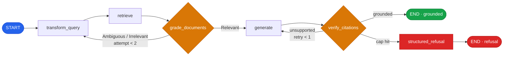

# Tax Authority Enterprise RAG

An evidence-backed repository for designing, validating, and operationalizing a secure enterprise Retrieval-Augmented Generation (RAG) system for a national tax authority.

This project focuses on the hard parts of enterprise RAG:

- **zero-hallucination citation workflows**
- **mathematically safe RBAC filtering inside vector retrieval**
- **hybrid BM25 + dense search at scale**
- **AWS-native observability and evaluation gates**
- **design-to-test traceability across architecture, implementation scaffolding, and reports**

> This repository is best understood as an **enterprise RAG architecture and evaluation repository** with runnable test infrastructure and supporting documentation. It is not positioned as a finished end-user web application.

---
## Video and presentation assets

- **Video:** https://youtu.be/ZEdFqNcd7Ms
- **Slides (PDF):** [`docs/slides-export.pdf`](docs/slides-export.pdf)

---

## What this repository contains

### 1. Architecture and design
- `design/FINAL-rag-architecture.md` — consolidated submission-ready architecture document
- `design/module-1-2-retrieval.md` — ingestion, chunking, vector DB, hybrid retrieval, reranking
- `design/module-3-agentic.md` — CRAG loop, query transforms, grader, citation verifier
- `design/module-4-ops-security.md` — RBAC, cache design, CI gates, observability

### 2. Evaluation harness
- `tests/` — pytest-based evaluation suite
- `tests/conftest.py` — shared fixtures, synthetic corpus, mock/reference RAG logic, judges, telemetry helpers
- `tests/TEST-PLAN.md` — evaluation strategy and promotion gates

### 3. Infrastructure scaffolding
- `docker/docker-compose.yml` — OpenSearch, Redis Stack, Jaeger, app container wiring
- `docker/Dockerfile` — Python runtime container for evaluation runs
- `scripts/` — seeding, evaluation, debugging, threshold checks

### 4. Reports and validation artifacts
- `reports/test-results.md` — evaluation summary and integration findings
- `reports/jaeger-observability.md` — trace analysis and observability rationale
- `reports/PROCESS-REPORT.md` — multi-agent methodology and provenance report

---

## Core technical stance

This repository is built around several architectural decisions:

- **Vector store:** Amazon OpenSearch Service with Lucene HNSW
- **Embeddings:** Cohere `embed-multilingual-v3` via AWS Bedrock
- **Reranking:** Cohere `rerank-v3-5:0` via AWS Bedrock
- **LLM / grader / judge:** Claude Haiku 4.5 via Bedrock cross-region inference profile
- **Cache:** Redis Stack 7.4
- **Tracing:** OpenTelemetry → Jaeger

The most important security decision is the use of OpenSearch **`efficient_filter`** so RBAC constraints are applied **inside HNSW traversal**, preventing empty-set and timing side-channel leaks from classified material.

---

## CRAG control flow



This diagram shows the **Corrective RAG (CRAG)** control loop at the core of the design. The system does not trust retrieval or generation automatically: it retrieves evidence, grades whether that evidence is sufficient, generates only when grounded, and then verifies citations before returning a final answer. If grounding fails, it loops safely or refuses rather than hallucinating.

---

## Why this project matters

Enterprise RAG in regulated domains is not only about “making retrieval work.” It must also answer questions such as:

- How do we guarantee that a helpdesk user never learns that FIOD-only material exists?
- How do we prevent article-level citations that are wrong at `lid` / `onderdeel` depth?
- How do we validate retrieval quality before generation begins?
- How do we enforce quality gates before new models or retrieval settings reach production?
- How do we make latency and model behavior observable end to end?

This repository addresses those questions with a combination of:

- architecture documents
- explicit evaluation contracts
- security reasoning
- reproducible test scaffolding
- infrastructure definitions

---

The repository itself was produced through a multi-agent workflow: parallel design, domain review, test design, infrastructure execution, final compilation, and methodology reporting.

---

## Current repository maturity

This repository should be described as:

- **architecture-complete**
- **evaluation-heavy**
- **infrastructure-backed**
- **prototype / blueprint grade**

It is **not** currently presented as a complete user-facing production API. The repository contains strong design and validation artifacts, plus partial real integrations, but the primary value is in the **system blueprint and evidence-backed evaluation framework**.

---

## Repository structure

```text
.
├── design/      # architecture modules and final compiled design
├── docker/      # container definitions and local stack orchestration
├── plans/       # planning and decision records
├── reports/     # evaluation and process artifacts
├── scripts/     # helper scripts for eval, seeding, and CI gates
├── tests/       # pytest evaluation suite, fixtures, synthetic corpus logic
└── Present/     # study and presentation materials
```

---

## Evaluation status snapshot

From `reports/test-results.md`:

- **170/170 mock tests green**
- **3/3 Redis integration tests green**
- additional **Bedrock-backed integration findings** documented separately

The repository distinguishes clearly between:

- **mock / deterministic validation paths** for fast iteration
- **real service integration paths** for Bedrock, Redis, OpenSearch, and observability evidence

---

## Recommended audience

This repository is most useful for:

- platform architects
- ML / AI engineers building enterprise RAG systems
- security reviewers evaluating retrieval-side access control
- technical interview reviewers assessing system design depth
- teams designing governance-ready LLM systems in regulated environments

---

## Suggested reading order

If you are new to the repository, read in this order:

1. `design/FINAL-rag-architecture.md`
2. `plans/MASTER-PLAN.md`
3. `tests/TEST-PLAN.md`
4. `reports/test-results.md`
5. `reports/jaeger-observability.md`
6. `reports/PROCESS-REPORT.md`

---

## Running the evaluation stack

This repository includes Docker and script scaffolding for local evaluation runs.

Key files:

- `docker/docker-compose.yml`
- `docker/Dockerfile`
- `scripts/run-eval.sh`
- `tests/seed_opensearch.py`

Before running anything, review:

- `docker/.env.example`
- `docker/IAM-POLICY.md`

You will need valid AWS credentials and Bedrock access for the configured model IDs.

---

## Security note

This repository discusses sensitive access-control design patterns for regulated data. Even in prototype or evaluation mode:

- do not commit real secrets
- do not use root credentials in shared workflows
- treat RBAC and redaction behavior as first-class test concerns

See [`SECURITY.md`](SECURITY.md) for repository guidance.

---

## Contributing

Contributions are welcome, especially around:

- architecture clarity
- evaluation rigor
- reproducibility
- documentation quality

Please read [`CONTRIBUTING.md`](CONTRIBUTING.md) before opening a change.

---

## Citation / attribution

If you reference this repository in a technical discussion or review, please cite it as an **enterprise RAG architecture and evaluation repository** rather than a finished production application.
